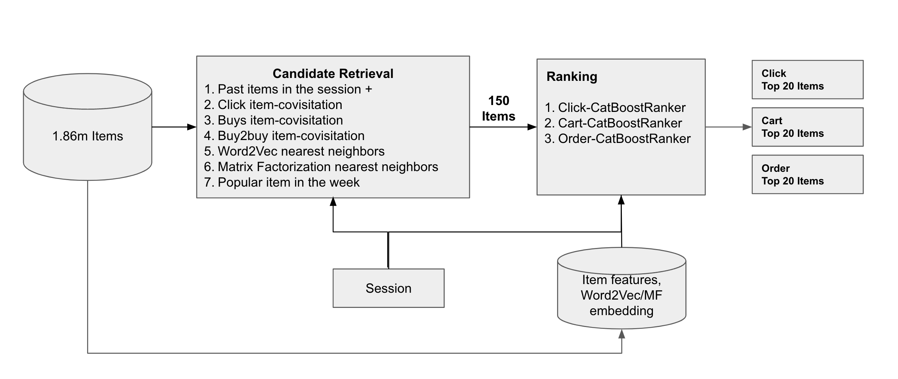

# kaggle-otto-multi-objective-recsys

Top 7% (Bronze medal) solution for [Kaggle Otto RecSys Competition](https://www.kaggle.com/competitions/otto-recommender-system)

The solution was two-stage model where it had (1) Candidate Retrieval and (2) Ranking.



## Run Training Pipeline

```bash
# retrieve candidates and make features based on training set
./prepare_training.sh

# retrieve candidates and make features based on validation set
./prepare_validation.sh

# train & measure CV score
./run_training.sh
```

## Run Scoring Pipeline

```bash
# retrieve candidates and make features based on test set
./prepare_scoring.sh

# scoring and make submission
./run_scoring.sh
```

In the bash script, need to define following env variables

1. CLICK_MODEL
2. CART_MODEL
3. ORDER_MODEL

These values should refer to model artifact's name (output from training pipeline)

## Setup

```bash
# create virtual env
conda create --name kaggle-otto python=3.10
# activate env
conda activate kaggle-otto
# install requirements
pip install -r requirements.txt
```
